# Flora_X: Complete Production-Ready PostgreSQL Database Design Document
**Version:** 1.0.0  
**Author:** Principal Database Architect  
**Project:** Flora_X Multi-Vendor Marketplace  

---

## 1. Executive Summary & ER Diagram

This document outlines the complete enterprise-grade database architecture for **Flora_X**, a scalable, multi-vendor flower and gift marketplace tailored for the Kenyan market. 

To support millions of transactions, strict financial compliance, multi-vendor checkouts, and AI integrations, we utilize **PostgreSQL 16+**. The design incorporates a relational schema optimized to Third Normal Form (3NF), implementing strict foreign key constraints, high-performance composite indices, secure audit trails, soft deletes, and robust double-entry accounting ledgers.

### 1.1. Entity-Relationship Diagram (Mermaid)

```mermaid
erDiagram
    users ||--o| customer_profiles : "has"
    users ||--o| florist_profiles : "registers"
    users ||--o{ user_sessions : "maintains"
    users ||--o{ password_resets : "requests"
    users ||--o{ email_verifications : "verifies"

    customer_profiles ||--o{ customer_addresses : "saves"
    customer_profiles ||--o{ wishlists : "creates"
    customer_profiles ||--o{ reward_points_ledger : "accumulates"
    customer_profiles ||--o{ referral_relations : "refers"

    florist_profiles ||--o{ products : "manages"
    florist_profiles ||--o| florist_wallets : "has"
    florist_profiles ||--o{ withdrawal_requests : "submits"
    florist_profiles ||--o{ business_hours : "operates"
    florist_profiles ||--o{ florist_coupons : "issues"

    products ||--o{ product_variants : "has"
    products ||--o{ inventory_stock_history : "logs"
    products ||--o{ product_reviews : "receives"
    products ||--o{ related_products : "associates"

    parent_orders ||--o{ sub_orders : "splits into"
    parent_orders ||--|| payments_transactions : "processes"
    
    sub_orders ||--o{ order_items : "contains"
    sub_orders ||--o{ order_timeline_events : "logs"
    sub_orders ||--o| delivery_reviews : "rates"
    sub_orders ||--o| florist_reviews : "rates"

    order_items ||--|| product_variants : "references"

    florist_wallets ||--o{ wallet_ledger : "tracks balance via"
    payments_transactions ||--o{ wallet_ledger : "triggers"

    conversations ||--o{ conversation_participants : "groups"
    conversations ||--o{ chat_messages : "contains"
    chat_messages ||--o{ chat_attachments : "holds"

    blogs ||--|| blog_categories : "classified under"
    blogs ||--|| authors : "written by"
```



---

## 2. Global Database Conventions & Standards

To ensure consistency across migrations, queries, and administrative procedures, the Flora_X database strictly adheres to the following structural patterns:

### 2.1. Naming Conventions
* **Case & Format:** All identifiers (table names, column names, index names, trigger names) are strictly in **snake_case** and lower case.
* **Pluralization:** Table names are **plural** (e.g., `users`, `products`, `orders`). Junction tables use a singular prefix describing the relationship or names of parent tables (e.g., `referral_relations`, `related_products`).
* **ID Columns:** Primary keys are consistently named `id`. Foreign keys follow the format `{singular_parent_table_name}_id` (e.g., `user_id` referencing table `users`).

### 2.2. Primary Key Strategy: UUIDv7
Instead of standard sequential integer IDs or random UUIDv4, we standardize on **UUIDv7** for all tables.
* **Rationale:** UUIDv7 contains a millisecond-precision Unix timestamp in its most significant 48 bits. This makes them **chronologically sortable**, significantly reducing B-tree index fragmentation and page splits in clustered keys during heavy insert volumes, while keeping IDs globally unique and safe to expose in public APIs.
* **Fallback for Local DB Setup:** If the local PG environment does not support standard UUIDv7 extensions, sequential cryptographic UUID generators or standard UUIDv4 are mapped as secondary defaults.

### 2.3. Soft Delete Strategy
Critical tables (such as `users`, `florist_profiles`, `products`, `customer_addresses`) must never be hard-deleted from disk to preserve foreign key historical data and financial ledger integrity.
* **Implementation:** Every soft-deletable table has a `deleted_at` column of type `TIMESTAMP WITH TIME ZONE NULL`.
* **Queries:** Client-facing queries filter with `WHERE deleted_at IS NULL`. We implement partial indexes (e.g., `CREATE INDEX ... WHERE deleted_at IS NULL`) to maintain high performance.

### 2.4. Timestamp Strategy
* Every table includes `created_at` and `updated_at` as `TIMESTAMP WITH TIME ZONE NOT NULL DEFAULT CURRENT_TIMESTAMP`.
* An automated generic trigger function updates `updated_at` before any record modification:
```sql
CREATE OR REPLACE FUNCTION update_timestamp_column()
RETURNS TRIGGER AS $$
BEGIN
    NEW.updated_at = CURRENT_TIMESTAMP;
    RETURN NEW;
END;
$$ LANGUAGE plpgsql;
```

---

## 3. Modular Schema Specifications

---

### Module 3.1: Authentication & User Management

Handles core identity, secure hashing, social login references, roles, and session persistence.

#### 1. `roles` (System Level Roles)
Stores authorized system access roles.
* **Columns:**
  * `id` (VARCHAR(50) PRIMARY KEY): E.g., `'customer'`, `'florist'`, `'admin'`, `'super_admin'`.
  * `description` (TEXT).

#### 2. `users` (Core Identity Table)
Stores unified identity credentials for all actors.
* **Columns:**
  * `id` (UUID PRIMARY KEY DEFAULT uuidv7()): Chronologically sortable.
  * `email` (VARCHAR(255) UNIQUE NOT NULL): Lowercase, validated.
  * `password_hash` (VARCHAR(255) NULL): Hash using Argon2id. Nullable for pure Google Sign-In users.
  * `role_id` (VARCHAR(50) NOT NULL REFERENCES roles(id)): Enforces single primary role.
  * `is_verified` (BOOLEAN DEFAULT FALSE NOT NULL).
  * `created_at` (TIMESTAMPTZ DEFAULT NOW() NOT NULL).
  * `updated_at` (TIMESTAMPTZ DEFAULT NOW() NOT NULL).
  * `deleted_at` (TIMESTAMPTZ NULL): For soft deletes.
* **Constraints:**
  * `check_email_lower`: `CHECK (email = LOWER(email))`.
* **Indexes:**
  * `idx_users_email_active`: `CREATE UNIQUE INDEX idx_users_email_active ON users(email) WHERE deleted_at IS NULL;`

#### 3. `user_sessions` (Active Session Tokens)
Manages stateless JWT fallback tracking, active sessions, and multi-device revocation.
* **Columns:**
  * `id` (UUID PRIMARY KEY DEFAULT uuidv7()).
  * `user_id` (UUID NOT NULL REFERENCES users(id) ON DELETE CASCADE).
  * `refresh_token_hash` (VARCHAR(255) UNIQUE NOT NULL): SHA256 hashed refresh token.
  * `ip_address` (VARCHAR(45) NULL): Captures IPv4/IPv6.
  * `user_agent` (TEXT NULL).
  * `expires_at` (TIMESTAMPTZ NOT NULL).
  * `is_revoked` (BOOLEAN DEFAULT FALSE NOT NULL).
  * `created_at` (TIMESTAMPTZ DEFAULT NOW() NOT NULL).
* **Indexes:**
  * `idx_sessions_token`: `CREATE INDEX idx_sessions_token ON user_sessions(refresh_token_hash);`

#### 4. `password_resets` & `email_verifications` (OTPs & Sign-up Codes)
Tracks short-lived activation and password reset tokens.
* **Columns:**
  * `id` (UUID PRIMARY KEY DEFAULT uuidv7()).
  * `user_id` (UUID NOT NULL REFERENCES users(id) ON DELETE CASCADE).
  * `token_hash` (VARCHAR(255) NOT NULL).
  * `purpose` (VARCHAR(50) NOT NULL): E.g., `'email_verification'`, `'password_reset'`.
  * `expires_at` (TIMESTAMPTZ NOT NULL).
  * `used_at` (TIMESTAMPTZ NULL).
  * `created_at` (TIMESTAMPTZ DEFAULT NOW() NOT NULL).
* **Indexes:**
  * `idx_token_lookup`: `CREATE UNIQUE INDEX idx_token_lookup ON email_verifications(token_hash, purpose);`

---

### Module 3.2: Customer Domain

Manages specific attributes of purchasers, profiles, reward ledgers, and delivery addresses.

#### 1. `customer_profiles`
Maintains customer metadata.
* **Columns:**
  * `id` (UUID PRIMARY KEY DEFAULT uuidv7()).
  * `user_id` (UUID UNIQUE NOT NULL REFERENCES users(id) ON DELETE CASCADE).
  * `first_name` (VARCHAR(100) NOT NULL).
  * `last_name` (VARCHAR(100) NOT NULL).
  * `phone_number` (VARCHAR(20) UNIQUE NOT NULL): Standardized to E.164.
  * `google_id` (VARCHAR(255) UNIQUE NULL): Reference for OAuth logins.
  * `avatar_url` (VARCHAR(512) NULL).
  * `referred_by_id` (UUID NULL REFERENCES users(id) ON DELETE SET NULL): Track system referrals.
  * `reward_points_balance` (INT DEFAULT 0 NOT NULL): Cached running sum for speed.
  * `created_at` (TIMESTAMPTZ DEFAULT NOW() NOT NULL).
  * `updated_at` (TIMESTAMPTZ DEFAULT NOW() NOT NULL).

#### 2. `customer_addresses` (Delivery Book)
Saves multiple coordinates and delivery addresses.
* **Columns:**
  * `id` (UUID PRIMARY KEY DEFAULT uuidv7()).
  * `customer_id` (UUID NOT NULL REFERENCES customer_profiles(id) ON DELETE CASCADE).
  * `label` (VARCHAR(100) NOT NULL): E.g., `'Home'`, `'Office'`, `'Recipient Residence'`.
  * `street_address` (TEXT NOT NULL).
  * `city` (VARCHAR(100) DEFAULT 'Nairobi' NOT NULL).
  * `country` (VARCHAR(100) DEFAULT 'Kenya' NOT NULL).
  * `latitude` (NUMERIC(9,6) NOT NULL): Map precision coordinates.
  * `longitude` (NUMERIC(9,6) NOT NULL).
  * `delivery_instructions` (TEXT NULL): Custom notes.
  * `is_default` (BOOLEAN DEFAULT FALSE NOT NULL).
  * `created_at` (TIMESTAMPTZ DEFAULT NOW() NOT NULL).
  * `deleted_at` (TIMESTAMPTZ NULL).
* **Constraints:**
  * Single default address logic is enforced using a partial conditional unique index:
    `CREATE UNIQUE INDEX idx_single_default_address ON customer_addresses(customer_id) WHERE is_default = TRUE AND deleted_at IS NULL;`

#### 3. `reward_points_ledger` (Audit of Points Earned/Spent)
Acts as an auditable log of points activities.
* **Columns:**
  * `id` (UUID PRIMARY KEY DEFAULT uuidv7()).
  * `customer_id` (UUID NOT NULL REFERENCES customer_profiles(id) ON DELETE CASCADE).
  * `points_delta` (INT NOT NULL): Positive for reward, negative for redemption.
  * `reason` (VARCHAR(255) NOT NULL): E.g., `'Order Purchase'`, `'Referral Bonus'`, `'Signup Reward'`.
  * `reference_order_id` (UUID NULL): Link to transaction order, if applicable.
  * `created_at` (TIMESTAMPTZ DEFAULT NOW() NOT NULL).

---

### Module 3.3: Florist Domain

Encompasses florist profiles, verification levels, logistics settings, and payout details.

#### 1. `florist_profiles` (Verified Shop Profiles)
* **Columns:**
  * `id` (UUID PRIMARY KEY DEFAULT uuidv7()).
  * `user_id` (UUID UNIQUE NOT NULL REFERENCES users(id) ON DELETE CASCADE).
  * `store_name` (VARCHAR(255) UNIQUE NOT NULL).
  * `slug` (VARCHAR(255) UNIQUE NOT NULL): URL slug.
  * `description` (TEXT NULL).
  * `logo_url` (VARCHAR(512) NULL).
  * `banner_url` (VARCHAR(512) NULL).
  * `legal_business_name` (VARCHAR(255) NOT NULL).
  * `business_registration_number` (VARCHAR(100) UNIQUE NULL): National Business Registry Reference.
  * `mpesa_till_number` (VARCHAR(20) NOT NULL): Safaricom M-Pesa Merchant payout integration.
  * `mpesa_paybill_number` (VARCHAR(20) NULL).
  * `mpesa_account_number` (VARCHAR(100) NULL).
  * `latitude` (NUMERIC(9,6) NOT NULL): Hub origin location.
  * `longitude` (NUMERIC(9,6) NOT NULL).
  * `address_text` (TEXT NOT NULL).
  * `delivery_radius_km` (NUMERIC(5,2) DEFAULT 15.00 NOT NULL): Operational cutoff.
  * `minimum_order_amount` (NUMERIC(12,2) DEFAULT 0.00 NOT NULL).
  * `verification_status` (VARCHAR(50) DEFAULT 'pending_review' NOT NULL): `'pending_review'`, `'approved'`, `'suspended'`, `'rejected'`.
  * `commission_override_rate` (NUMERIC(5,2) NULL): If defined, overrides global platform 20.00%.
  * `rating_avg` (NUMERIC(3,2) DEFAULT 0.00 NOT NULL).
  * `rating_count` (INT DEFAULT 0 NOT NULL).
  * `created_at` (TIMESTAMPTZ DEFAULT NOW() NOT NULL).
  * `updated_at` (TIMESTAMPTZ DEFAULT NOW() NOT NULL).
  * `deleted_at` (TIMESTAMPTZ NULL).

#### 2. `business_hours` (Weekly Operational Calendar)
Stores operational intervals for delivery and fulfillment schedules.
* **Columns:**
  * `id` (UUID PRIMARY KEY DEFAULT uuidv7()).
  * `florist_id` (UUID NOT NULL REFERENCES florist_profiles(id) ON DELETE CASCADE).
  * `day_of_week` (INT NOT NULL): `0` (Sunday) to `6` (Saturday).
  * `open_time` (TIME NOT NULL).
  * `close_time` (TIME NOT NULL).
  * `is_closed` (BOOLEAN DEFAULT FALSE NOT NULL).
* **Constraints:**
  * `day_of_week_range`: `CHECK (day_of_week BETWEEN 0 AND 6)`.
  * `unique_florist_day`: `UNIQUE(florist_id, day_of_week)`.

---

### Module 3.4: Catalog & Product Management

Contains tables defining florist-owned products, physical variant configurations, stock logs, occasions, and tags.

#### 1. `categories` & `occasions` (Catalog Classification)
Standard categories (e.g., "Roses", "Letterbox Flowers") and occasions (e.g., "Mother's Day", "Sympathy").
* **Columns:**
  * `id` (UUID PRIMARY KEY DEFAULT uuidv7()).
  * `name` (VARCHAR(100) UNIQUE NOT NULL).
  * `slug` (VARCHAR(100) UNIQUE NOT NULL).
  * `type` (VARCHAR(50) NOT NULL): `'category'` or `'occasion'`.
  * `banner_image_url` (VARCHAR(512) NULL).
  * `description` (TEXT NULL).

#### 2. `products` (Parent Product Catalog)
* **Columns:**
  * `id` (UUID PRIMARY KEY DEFAULT uuidv7()).
  * `florist_id` (UUID NOT NULL REFERENCES florist_profiles(id) ON DELETE CASCADE).
  * `title` (VARCHAR(255) NOT NULL).
  * `slug` (VARCHAR(255) NOT NULL): Scope relative to URL structure.
  * `description` (TEXT NOT NULL).
  * `primary_image_url` (VARCHAR(512) NOT NULL).
  * `gallery_images` (JSONB DEFAULT '[]'::jsonb NOT NULL): Secondary layout files array.
  * `category_id` (UUID REFERENCES categories(id) ON DELETE SET NULL).
  * `occasion_id` (UUID REFERENCES categories(id) ON DELETE SET NULL).
  * `tags` (VARCHAR(50)[] NULL): GIN indexable tags for quick matching.
  * `is_active` (BOOLEAN DEFAULT TRUE NOT NULL).
  * `ai_generated` (BOOLEAN DEFAULT FALSE NOT NULL): True if content processed via Gemini API.
  * `seo_title` (VARCHAR(255) NULL).
  * `seo_description` (TEXT NULL).
  * `created_at` (TIMESTAMPTZ DEFAULT NOW() NOT NULL).
  * `updated_at` (TIMESTAMPTZ DEFAULT NOW() NOT NULL).
  * `deleted_at` (TIMESTAMPTZ NULL).
* **Indexes:**
  * `idx_products_tags`: `CREATE INDEX idx_products_tags ON products USING gin(tags);`
  * `idx_active_products`: `CREATE INDEX idx_active_products ON products(id) WHERE is_active = TRUE AND deleted_at IS NULL;`

#### 3. `product_variants` (Variant Configurations)
Supports size variants (e.g., "Standard", "Deluxe", "Grandee") with unique price points.
* **Columns:**
  * `id` (UUID PRIMARY KEY DEFAULT uuidv7()).
  * `product_id` (UUID NOT NULL REFERENCES products(id) ON DELETE CASCADE).
  * `sku` (VARCHAR(100) UNIQUE NOT NULL).
  * `title` (VARCHAR(150) NOT NULL): E.g., `'Standard Bouquet (12 Roses)'`, `'Deluxe Bouquet (24 Roses)'`.
  * `price` (NUMERIC(12,2) NOT NULL): Stored as base currency (KES).
  * `compare_at_price` (NUMERIC(12,2) NULL): Strike-through price for sales.
  * `inventory_qty` (INT DEFAULT 0 NOT NULL): Physical quantity available.
  * `weight_grams` (INT DEFAULT 0 NOT NULL).
  * `created_at` (TIMESTAMPTZ DEFAULT NOW() NOT NULL).
  * `updated_at` (TIMESTAMPTZ DEFAULT NOW() NOT NULL).
* **Constraints:**
  * `price_positive`: `CHECK (price >= 0.00)`.
  * `inventory_non_negative`: `CHECK (inventory_qty >= 0)`.

#### 4. `inventory_stock_history` (Stock Ledger)
Logs stock adjustments for auditing.
* **Columns:**
  * `id` (UUID PRIMARY KEY DEFAULT uuidv7()).
  * `variant_id` (UUID NOT NULL REFERENCES product_variants(id) ON DELETE CASCADE).
  * `quantity_delta` (INT NOT NULL): Positive for stock additions, negative for sales/damage.
  * `reason` (VARCHAR(100) NOT NULL): E.g., `'Restock'`, `'Order Purchase'`, `'Wastage'`, `'Audit Adjustment'`.
  * `adjusted_by_id` (UUID NULL REFERENCES users(id)): Admin/Florist ID.
  * `created_at` (TIMESTAMPTZ DEFAULT NOW() NOT NULL).

#### 5. `related_products` (Symmetric Associations)
Establishes related item pairings for cross-selling.
* **Columns:**
  * `product_id_a` (UUID REFERENCES products(id) ON DELETE CASCADE).
  * `product_id_b` (UUID REFERENCES products(id) ON DELETE CASCADE).
  * PRIMARY KEY (`product_id_a`, `product_id_b`).

---

### Module 3.5: Shopping, Checkout & Ordering

Orchestrates multi-vendor ordering, delivery schedules, sub-orders, and status progression.

#### 1. `carts` (Active Shopping Sessions)
* **Columns:**
  * `id` (UUID PRIMARY KEY DEFAULT uuidv7()).
  * `customer_id` (UUID NULL REFERENCES customer_profiles(id) ON DELETE CASCADE): Optional for anonymous guest carts.
  * `session_key` (VARCHAR(255) UNIQUE NOT NULL): Fallback mapping for guest sessions.
  * `created_at` (TIMESTAMPTZ DEFAULT NOW() NOT NULL).
  * `updated_at` (TIMESTAMPTZ DEFAULT NOW() NOT NULL).

#### 2. `cart_items`
* **Columns:**
  * `id` (UUID PRIMARY KEY DEFAULT uuidv7()).
  * `cart_id` (UUID NOT NULL REFERENCES carts(id) ON DELETE CASCADE).
  * `variant_id` (UUID NOT NULL REFERENCES product_variants(id) ON DELETE CASCADE).
  * `quantity` (INT DEFAULT 1 NOT NULL).
  * `created_at` (TIMESTAMPTZ DEFAULT NOW() NOT NULL).
* **Constraints:**
  * `qty_positive`: `CHECK (quantity > 0)`.
  * `unique_cart_variant`: `UNIQUE (cart_id, variant_id)`.

#### 3. `parent_orders` (The Consolidated Checkout Record)
When a customer pays, a single transaction record is logged.
* **Columns:**
  * `id` (UUID PRIMARY KEY DEFAULT uuidv7()).
  * `customer_id` (UUID NOT NULL REFERENCES customer_profiles(id)).
  * `grand_total` (NUMERIC(12,2) NOT NULL): Complete checkout cost including delivery & taxes.
  * `discount_amount` (NUMERIC(12,2) DEFAULT 0.00 NOT NULL).
  * `points_redeemed_id` (UUID NULL REFERENCES reward_points_ledger(id)).
  * `payment_status` (VARCHAR(50) DEFAULT 'unpaid' NOT NULL): `'unpaid'`, `'processing'`, `'paid'`, `'failed'`.
  * `created_at` (TIMESTAMPTZ DEFAULT NOW() NOT NULL).
  * `updated_at` (TIMESTAMPTZ DEFAULT NOW() NOT NULL).

#### 4. `sub_orders` (The Multi-Vendor Split Orders)
Under a single checkout, the parent order splits into distinct sub-orders for each florist.
* **Columns:**
  * `id` (UUID PRIMARY KEY DEFAULT uuidv7()).
  * `parent_order_id` (UUID NOT NULL REFERENCES parent_orders(id) ON DELETE CASCADE).
  * `florist_id` (UUID NOT NULL REFERENCES florist_profiles(id)).
  * `sub_total` (NUMERIC(12,2) NOT NULL): Total cost of items from this florist.
  * `delivery_fee` (NUMERIC(12,2) NOT NULL): Distance-based fee for this florist.
  * `tax_amount` (NUMERIC(12,2) DEFAULT 0.00 NOT NULL): VAT (16% in Kenya) applied to items.
  * `platform_commission` (NUMERIC(12,2) NOT NULL): 20% platform cut (or custom override).
  * `florist_net_earnings` (NUMERIC(12,2) NOT NULL): Calculated as `sub_total - platform_commission`.
  * `fulfillment_status` (VARCHAR(50) DEFAULT 'received' NOT NULL): `'received'`, `'preparing'`, `'ready_for_pickup'`, `'out_for_delivery'`, `'delivered'`, `'refund_requested'`, `'refund_approved'`, `'cancelled'`.
  * `recipient_name` (VARCHAR(150) NOT NULL).
  * `recipient_phone` (VARCHAR(20) NOT NULL).
  * `delivery_address` (TEXT NOT NULL).
  * `delivery_latitude` (NUMERIC(9,6) NOT NULL).
  * `delivery_longitude` (NUMERIC(9,6) NOT NULL).
  * `delivery_date` (DATE NOT NULL).
  * `delivery_slot` (VARCHAR(100) NULL): E.g., `'Morning (8 AM - 12 PM)'`, `'Afternoon (1 PM - 5 PM)'`.
  * `gift_card_message` (TEXT NULL).
  * `delivery_instructions` (TEXT NULL).
  * `created_at` (TIMESTAMPTZ DEFAULT NOW() NOT NULL).
  * `updated_at` (TIMESTAMPTZ DEFAULT NOW() NOT NULL).

#### 5. `order_items` (Specific Purchased Variants)
* **Columns:**
  * `id` (UUID PRIMARY KEY DEFAULT uuidv7()).
  * `sub_order_id` (UUID NOT NULL REFERENCES sub_orders(id) ON DELETE CASCADE).
  * `variant_id` (UUID NOT NULL REFERENCES product_variants(id)).
  * `quantity` (INT NOT NULL).
  * `unit_price` (NUMERIC(12,2) NOT NULL): Price at checkout to capture pricing snapshot.
* **Constraints:**
  * `qty_positive`: `CHECK (quantity > 0)`.

#### 6. `order_timeline_events` (Fulfillment Tracking Logs)
Funnels detailed status events to customer and administration dashboards.
* **Columns:**
  * `id` (UUID PRIMARY KEY DEFAULT uuidv7()).
  * `sub_order_id` (UUID NOT NULL REFERENCES sub_orders(id) ON DELETE CASCADE).
  * `event_status` (VARCHAR(50) NOT NULL): E.g., `'preparing'`, `'shipped'`, `'delivered'`.
  * `description` (TEXT NOT NULL): E.g., `'Your bouquet is being hand-crafted by Nairobi Blooms'`.
  * `notified_customer` (BOOLEAN DEFAULT FALSE NOT NULL).
  * `created_at` (TIMESTAMPTZ DEFAULT NOW() NOT NULL).

---

### Module 3.6: Payments, Ledger & Commissions

Contains financial ledger, M-Pesa callbacks, balances, and payouts data.

#### 1. `payments_transactions` (Lipa Na M-Pesa Tracking)
Captures transaction details for payments made via Safaricom Daraja STK Push.
* **Columns:**
  * `id` (UUID PRIMARY KEY DEFAULT uuidv7()).
  * `parent_order_id` (UUID UNIQUE NOT NULL REFERENCES parent_orders(id)).
  * `merchant_request_id` (VARCHAR(150) UNIQUE NOT NULL): Daraja STK request ID.
  * `checkout_request_id` (VARCHAR(150) UNIQUE NOT NULL): Daraja STK checkout ID.
  * `mpesa_receipt_number` (VARCHAR(100) UNIQUE NULL): Populated via webhook upon payment success.
  * `phone_number` (VARCHAR(20) NOT NULL): Payer's phone number.
  * `amount` (NUMERIC(12,2) NOT NULL).
  * `transaction_status` (VARCHAR(50) DEFAULT 'initiated' NOT NULL): `'initiated'`, `'success'`, `'failed'`, `'cancelled'`.
  * `callback_payload` (JSONB NULL): Stores raw callback metadata for debugging.
  * `error_description` (TEXT NULL).
  * `completed_at` (TIMESTAMPTZ NULL).
  * `created_at` (TIMESTAMPTZ DEFAULT NOW() NOT NULL).

#### 2. `florist_wallets` (Store Balances)
Stores real-time, consolidated balances for florists.
* **Columns:**
  * `id` (UUID PRIMARY KEY DEFAULT uuidv7()).
  * `florist_id` (UUID UNIQUE NOT NULL REFERENCES florist_profiles(id) ON DELETE CASCADE).
  * `available_balance` (NUMERIC(12,2) DEFAULT 0.00 NOT NULL).
  * `pending_balance` (NUMERIC(12,2) DEFAULT 0.00 NOT NULL): Escrow balance held until delivery.
  * `withdrawn_to_date` (NUMERIC(12,2) DEFAULT 0.00 NOT NULL).
  * `updated_at` (TIMESTAMPTZ DEFAULT NOW() NOT NULL).

#### 3. `wallet_ledger` (Auditable Double-Entry Ledger)
No direct edits to `available_balance` are permitted without a corresponding ledger entry, ensuring financial accuracy.
* **Columns:**
  * `id` (UUID PRIMARY KEY DEFAULT uuidv7()).
  * `wallet_id` (UUID NOT NULL REFERENCES florist_wallets(id) ON DELETE RESTRICT).
  * `amount` (NUMERIC(12,2) NOT NULL): Positive for credits (earnings), negative for debits (withdrawals, refunds).
  * `entry_type` (VARCHAR(50) NOT NULL): `'credit_earnings'`, `'debit_withdrawal'`, `'commission_deduction'`, `'refund_chargeback'`.
  * `sub_order_id` (UUID NULL REFERENCES sub_orders(id)): Reference for order earnings.
  * `withdrawal_request_id` (UUID NULL): Reference for payouts.
  * `description` (TEXT NOT NULL).
  * `balance_snapshot` (NUMERIC(12,2) NOT NULL): Balance after transaction processing, useful for audits.
  * `created_at` (TIMESTAMPTZ DEFAULT NOW() NOT NULL).

#### 4. `withdrawal_requests` (Florist Monthly Payout Portal)
* **Columns:**
  * `id` (UUID PRIMARY KEY DEFAULT uuidv7()).
  * `florist_id` (UUID NOT NULL REFERENCES florist_profiles(id) ON DELETE RESTRICT).
  * `amount` (NUMERIC(12,2) NOT NULL).
  * `payout_channel` (VARCHAR(50) DEFAULT 'mpesa' NOT NULL): `'mpesa_till'`, `'mpesa_paybill'`, `'bank'`.
  * `status` (VARCHAR(50) DEFAULT 'pending' NOT NULL): `'pending'`, `'processing'`, `'completed'`, `'rejected'`.
  * `admin_notes` (TEXT NULL).
  * `payout_reference` (VARCHAR(150) UNIQUE NULL): Reference ID from the payout gateway.
  * `processed_at` (TIMESTAMPTZ NULL).
  * `created_at` (TIMESTAMPTZ DEFAULT NOW() NOT NULL).
* **Constraints:**
  * `amount_positive`: `CHECK (amount > 0.00)`.

---

### Module 3.7: Customer Reviews, Trust & Reputation

Tracks and manages reviews for products, florists, and delivery services.

#### 1. `product_reviews`
* **Columns:**
  * `id` (UUID PRIMARY KEY DEFAULT uuidv7()).
  * `sub_order_id` (UUID NOT NULL REFERENCES sub_orders(id) ON DELETE RESTRICT): Ensures reviews are from verified purchases.
  * `customer_id` (UUID NOT NULL REFERENCES customer_profiles(id) ON DELETE CASCADE).
  * `product_id` (UUID NOT NULL REFERENCES products(id) ON DELETE CASCADE).
  * `rating` (INT NOT NULL).
  * `review_text` (TEXT NULL).
  * `review_images` (JSONB DEFAULT '[]'::jsonb NOT NULL): Array of uploaded product images.
  * `moderation_status` (VARCHAR(50) DEFAULT 'approved' NOT NULL): `'pending_approval'`, `'approved'`, `'flagged'`.
  * `created_at` (TIMESTAMPTZ DEFAULT NOW() NOT NULL).
* **Constraints:**
  * `rating_range`: `CHECK (rating BETWEEN 1 AND 5)`.
  * `unique_order_product`: `UNIQUE (sub_order_id, product_id)`.

#### 2. `florist_reviews`
* **Columns:**
  * `id` (UUID PRIMARY KEY DEFAULT uuidv7()).
  * `sub_order_id` (UUID UNIQUE NOT NULL REFERENCES sub_orders(id) ON DELETE RESTRICT).
  * `customer_id` (UUID NOT NULL REFERENCES customer_profiles(id) ON DELETE CASCADE).
  * `florist_id` (UUID NOT NULL REFERENCES florist_profiles(id) ON DELETE CASCADE).
  * `rating` (INT NOT NULL).
  * `review_text` (TEXT NULL).
  * `moderation_status` (VARCHAR(50) DEFAULT 'approved' NOT NULL).
  * `created_at` (TIMESTAMPTZ DEFAULT NOW() NOT NULL).
* **Constraints:**
  * `rating_range`: `CHECK (rating BETWEEN 1 AND 5)`.

#### 3. `delivery_reviews`
* **Columns:**
  * `id` (UUID PRIMARY KEY DEFAULT uuidv7()).
  * `sub_order_id` (UUID UNIQUE NOT NULL REFERENCES sub_orders(id) ON DELETE RESTRICT).
  * `rating` (INT NOT NULL).
  * `review_text` (TEXT NULL).
  * `created_at` (TIMESTAMPTZ DEFAULT NOW() NOT NULL).
* **Constraints:**
  * `rating_range`: `CHECK (rating BETWEEN 1 AND 5)`.

---

### Module 3.8: Messaging & Conversations

Provides a workspace for communication between customers, florists, and support staff.

#### 1. `conversations` (Active Messaging Channels)
* **Columns:**
  * `id` (UUID PRIMARY KEY DEFAULT uuidv7()).
  * `sub_order_id` (UUID NULL REFERENCES sub_orders(id) ON DELETE SET NULL): Optional order association.
  * `created_at` (TIMESTAMPTZ DEFAULT NOW() NOT NULL).

#### 2. `conversation_participants` (Junction Table for Access Rules)
* **Columns:**
  * `conversation_id` (UUID REFERENCES conversations(id) ON DELETE CASCADE).
  * `user_id` (UUID REFERENCES users(id) ON DELETE CASCADE).
  * PRIMARY KEY (`conversation_id`, `user_id`).

#### 3. `chat_messages`
* **Columns:**
  * `id` (UUID PRIMARY KEY DEFAULT uuidv7()).
  * `conversation_id` (UUID NOT NULL REFERENCES conversations(id) ON DELETE CASCADE).
  * `sender_id` (UUID NOT NULL REFERENCES users(id) ON DELETE RESTRICT).
  * `message_body` (TEXT NOT NULL).
  * `is_read` (BOOLEAN DEFAULT FALSE NOT NULL).
  * `created_at` (TIMESTAMPTZ DEFAULT NOW() NOT NULL).

#### 4. `chat_attachments`
* **Columns:**
  * `id` (UUID PRIMARY KEY DEFAULT uuidv7()).
  * `message_id` (UUID NOT NULL REFERENCES chat_messages(id) ON DELETE CASCADE).
  * `file_url` (VARCHAR(512) NOT NULL).
  * `file_type` (VARCHAR(100) NOT NULL).
  * `created_at` (TIMESTAMPTZ DEFAULT NOW() NOT NULL).

---

### Module 3.9: Content Management (CMS) & Knowledge Base

Manages FAQs, blog posts, authors, careers, static pages, and policies.

#### 1. `authors` (Blog Editors)
* **Columns:**
  * `id` (UUID PRIMARY KEY DEFAULT uuidv7()).
  * `user_id` (UUID REFERENCES users(id) ON DELETE SET NULL).
  * `display_name` (VARCHAR(150) NOT NULL).
  * `bio` (TEXT NULL).
  * `avatar_url` (VARCHAR(512) NULL).

#### 2. `blog_categories`
* **Columns:**
  * `id` (UUID PRIMARY KEY DEFAULT uuidv7()).
  * `name` (VARCHAR(100) UNIQUE NOT NULL).
  * `slug` (VARCHAR(100) UNIQUE NOT NULL).

#### 3. `blogs` (Editorial Portal)
* **Columns:**
  * `id` (UUID PRIMARY KEY DEFAULT uuidv7()).
  * `author_id` (UUID NOT NULL REFERENCES authors(id)).
  * `category_id` (UUID NOT NULL REFERENCES blog_categories(id)).
  * `title` (VARCHAR(255) NOT NULL).
  * `slug` (VARCHAR(255) UNIQUE NOT NULL).
  * `body_content` (TEXT NOT NULL).
  * `featured_image_url` (VARCHAR(512) NOT NULL).
  * `published_at` (TIMESTAMPTZ NULL).
  * `is_published` (BOOLEAN DEFAULT FALSE NOT NULL).
  * `seo_title` (VARCHAR(255) NULL).
  * `seo_description` (TEXT NULL).
  * `created_at` (TIMESTAMPTZ DEFAULT NOW() NOT NULL).
  * `updated_at` (TIMESTAMPTZ DEFAULT NOW() NOT NULL).

#### 4. `faqs` (Frequently Asked Questions)
* **Columns:**
  * `id` (UUID PRIMARY KEY DEFAULT uuidv7()).
  * `question` (TEXT NOT NULL).
  * `answer` (TEXT NOT NULL).
  * `display_order` (INT DEFAULT 0 NOT NULL).
  * `category` (VARCHAR(100) DEFAULT 'General' NOT NULL).

---

### Module 3.10: Marketing, Coupons & Campaigns

Manages promotional campaigns, coupons, and discounts.

#### 1. `coupons` (System & Florist Coupons)
Allows both platform-wide and florist-specific coupon codes.
* **Columns:**
  * `id` (UUID PRIMARY KEY DEFAULT uuidv7()).
  * `code` (VARCHAR(50) UNIQUE NOT NULL): Uppercase, non-spaced code.
  * `scope` (VARCHAR(50) NOT NULL): `'global'` (platform-wide) or `'florist_specific'`.
  * `florist_id` (UUID NULL REFERENCES florist_profiles(id) ON DELETE CASCADE): If scoped to a specific florist.
  * `discount_type` (VARCHAR(50) NOT NULL): `'percentage'` or `'fixed_amount'`.
  * `discount_value` (NUMERIC(12,2) NOT NULL).
  * `max_discount_amount` (NUMERIC(12,2) NULL): Upper limit for percentage-based discounts.
  * `minimum_purchase` (NUMERIC(12,2) DEFAULT 0.00 NOT NULL).
  * `start_date` (TIMESTAMPTZ NOT NULL).
  * `end_date` (TIMESTAMPTZ NOT NULL).
  * `usage_limit_total` (INT NULL): Maximum times the coupon can be used overall.
  * `usage_limit_per_user` (INT DEFAULT 1 NOT NULL): Maximum times a single user can apply it.
  * `used_count` (INT DEFAULT 0 NOT NULL).
  * `is_active` (BOOLEAN DEFAULT TRUE NOT NULL).
  * `created_at` (TIMESTAMPTZ DEFAULT NOW() NOT NULL).

---

### Module 3.11: AI Integration Logs & Cache

Caches AI recommendations and logs prompt queries for model tuning and transparency.

#### 1. `ai_generation_logs`
* **Columns:**
  * `id` (UUID PRIMARY KEY DEFAULT uuidv7()).
  * `prompt_type` (VARCHAR(100) NOT NULL): E.g., `'gift_recommender'`, `'seo_desc_generator'`.
  * `input_payload` (JSONB NOT NULL): Key inputs (such as occasion, recipient details, and florist context).
  * `generated_response` (TEXT NOT NULL): The output payload from the Gemini API.
  * `token_count` (INT DEFAULT 0 NOT NULL).
  * `created_at` (TIMESTAMPTZ DEFAULT NOW() NOT NULL).

#### 2. `customer_ai_recommendations` (Cached Customer Suggestions)
* **Columns:**
  * `id` (UUID PRIMARY KEY DEFAULT uuidv7()).
  * `customer_id` (UUID REFERENCES customer_profiles(id) ON DELETE CASCADE).
  * `occasion` (VARCHAR(100) NOT NULL).
  * `relationship` (VARCHAR(100) NOT NULL): E.g., `'Mother'`, `'Partner'`.
  * `recommended_product_ids` (UUID[] NOT NULL): List of recommended product IDs.
  * `feedback_rating` (INT NULL): Customer rating for the AI suggestion (1-5 stars).
  * `created_at` (TIMESTAMPTZ DEFAULT NOW() NOT NULL).

---

### Module 3.12: System Administration & Audit

Secures the marketplace through detailed audit trails, activity logs, and feature toggles.

#### 1. `audit_logs` (Security & Admin Ledger)
Tracks administrative actions to ensure complete operational accountability.
* **Columns:**
  * `id` (UUID PRIMARY KEY DEFAULT uuidv7()).
  * `admin_user_id` (UUID NOT NULL REFERENCES users(id) ON DELETE RESTRICT).
  * `action` (VARCHAR(150) NOT NULL): E.g., `'approve_florist'`, `'process_refund'`, `'change_global_commission'`.
  * `target_table` (VARCHAR(100) NOT NULL).
  * `target_id` (UUID NOT NULL).
  * `old_values` (JSONB NULL): Previous state snapshot.
  * `new_values` (JSONB NULL): Current updated state.
  * `ip_address` (VARCHAR(45) NOT NULL).
  * `created_at` (TIMESTAMPTZ DEFAULT NOW() NOT NULL).
* **Indexes:**
  * `idx_audit_actions`: `CREATE INDEX idx_audit_actions ON audit_logs(action, target_table);`

#### 2. `system_settings` & `feature_flags`
* **Columns:**
  * `key` (VARCHAR(100) PRIMARY KEY).
  * `value` (JSONB NOT NULL).
  * `description` (TEXT NULL).
  * `updated_at` (TIMESTAMPTZ DEFAULT NOW() NOT NULL).

---

## 4. Financial Integrity & Transaction Protection

To ensure accuracy, the platform handles currency and financial balances with strict consistency checks and transactional controls.

### 4.1. Double-Entry Payout Locking Flow
The financial engine follows two strict rules:
1. **No direct balance updates:** The `available_balance` and `pending_balance` in `florist_wallets` cannot be modified directly. They must be updated as part of a transaction that creates a matching record in the `wallet_ledger`.
2. **PostgreSQL Row-Level Locking:** During wallet updates, we lock the relevant row using `SELECT ... FOR UPDATE` to prevent race conditions during concurrent orders or withdrawals.

```sql
-- Step 1: Create a secure transaction block
BEGIN;

-- Step 2: Lock the florist wallet row for update
SELECT available_balance 
FROM florist_wallets 
WHERE florist_id = 'florist-uuid-here' 
FOR UPDATE;

-- Step 3: Insert the ledger credit transaction entry
INSERT INTO wallet_ledger(wallet_id, amount, entry_type, sub_order_id, description, balance_snapshot)
VALUES (
    'wallet-uuid-here', 
    3600.00, -- Gross amount minus the 20% commission
    'credit_earnings', 
    'suborder-uuid-here', 
    'Earnings for Sub-Order #1024',
    (SELECT available_balance + 3600.00 FROM florist_wallets WHERE florist_id = 'florist-uuid-here')
);

-- Step 4: Update the actual cached balance
UPDATE florist_wallets 
SET available_balance = available_balance + 3600.00 
WHERE florist_id = 'florist-uuid-here';

-- Step 5: Commit changes to write them permanently
COMMIT;
```

---

## 5. Performance, Indexing & Scaling Strategies

To maintain fast page loads and smooth checkout experiences under high traffic, the database uses tailored indexing and optimization strategies:

### 5.1. Specialized Indexes
* **Geospatial Proximity Queries:** To quickly locate local florists near a customer's address, we use spatial indexes (PostGIS indexing on coordinates) to calculate distance vectors efficiently.
```sql
CREATE INDEX idx_florist_geolocation ON florist_profiles USING gist (
  ST_SetSRID(ST_MakePoint(longitude, latitude), 4326)
);
```
* **Full-Text Catalog Search:** The system uses GIN indexes on search vector structures to allow users to search products quickly across tags and category attributes.
```sql
CREATE INDEX idx_products_search ON products USING gin(to_tsvector('english', title || ' ' || description));
```

### 5.2. Composite & Partial Indexes
* **Filtered Catalogs:** Catalog views only retrieve active products that have not been soft deleted. We use a partial index to skip deleted items entirely:
```sql
CREATE INDEX idx_active_catalog_products 
ON products(category_id, created_at DESC) 
WHERE is_active = TRUE AND deleted_at IS NULL;
```
* **Composite Query Optimization:** Queries filtering products by both florist and price use a composite index to locate matching records in a single pass:
```sql
CREATE INDEX idx_florist_product_price ON product_variants(product_id, price);
```

### 5.3. Horizontal Partitioning for High-Volume Tables
High-growth log and analytics tables (such as `order_timeline_events`, `chat_messages`, and `ai_generation_logs`) are partitioned by **Range of Date** to keep table sizes manageable and queries fast.

```sql
-- Partition parent table configuration
CREATE TABLE chat_messages_partitioned (
    id UUID NOT NULL,
    conversation_id UUID NOT NULL,
    sender_id UUID NOT NULL,
    message_body TEXT NOT NULL,
    created_at TIMESTAMPTZ NOT NULL DEFAULT NOW()
) PARTITION BY RANGE (created_at);

-- Example partition tables created per calendar year
CREATE TABLE chat_messages_y2026 PARTITION OF chat_messages_partitioned
    FOR VALUES FROM ('2026-01-01 00:00:00+00') TO ('2027-01-01 00:00:00+00');
```

---

## 6. High Availability, Replication & Backup Strategies

To prevent data loss and ensure maximum uptime, we recommend a robust database replication and backup structure:

```
                       ┌─────────────────────────┐
                       │  Primary DB Server (W)  │
                       └───────────┬─────────────┘
                                   │
              ┌────────────────────┴────────────────────┐
              ▼ (Async Replication)                     ▼ (Continuous Archiving)
   ┌───────────────────────┐                 ┌───────────────────────┐
   │ Read Replica DB 1 (R) │                 │   Secure AWS S3 Bucket│
   └───────────────────────┘                 │  - WAL Archiving      │
                                             │  - Daily Snapshots    │
                                             └───────────────────────┘
```

### 6.1. Replication Framework
* **Active Primary Node (Read/Write):** Processes checkouts, financial ledger updates, profile edits, and administrative operations.
* **Secondary Read Replicas:** Scale reads horizontally to handle catalog browsing, florist searches, and customer dashboards without overloading the primary database.

### 6.2. Backup & Disaster Recovery (Point-in-Time Recovery)
* **Continuous Archiving:** Write-Ahead Logs (WAL) are streamed continuously to a secure, private cloud bucket (e.g., AWS S3) using utilities like `WAL-G` or `pgBackRest`.
* **Daily Full Snapshots:** Automated, non-blocking daily logical backups (`pg_dump`) are captured during low-traffic windows and retained for 30 days to meet compliance standards.
* **Disaster Recovery Target:** This configuration supports a Recovery Point Objective (RPO) of **under 1 minute** and a Recovery Time Objective (RTO) of **under 15 minutes**.

---

## 7. Security, Compliance & Data Isolation

### 7.1. Database Network Isolation
* **Private Network Deployment:** The database runs in a isolated Private Virtual Cloud (VPC) with no public IP address. It can only be accessed via secure private connections from the Flask backend instances.
* **Encrypted Connections:** All connections between the backend and database are strictly encrypted via TLSv1.3.

### 7.2. Row-Level Security (RLS) for Multi-Tenant Data
To prevent data exposure across different florists, we enforce Row-Level Security on the database. This ensures a florist can only query records associated with their unique `florist_id`.

```sql
-- Step 1: Enable RLS on the florist-facing tables
ALTER TABLE products ENABLE ROW LEVEL SECURITY;

-- Step 2: Define the security policy based on the authenticated session context
CREATE POLICY florist_product_isolation ON products
    FOR ALL
    USING (florist_id = CURRENT_SETTING('app.current_florist_uuid', true)::UUID);
```

### 7.3. PII Masking & GDPR/NDPA Compliance
To comply with Kenya's Data Protection Act (NDPA) and global privacy standards:
* **Encryption of Sensitive Fields:** Sensitive customer details (such as recipient phone numbers, billing addresses, and payment tokens) are encrypted at rest using `pgcrypto` AES-256 tools.
* **Audit Trail Accountability:** Any administrative access to customer profiles or financial ledgers is fully captured in the `audit_logs` table.
